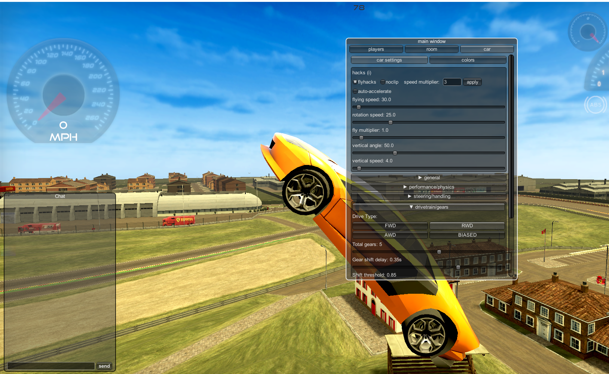
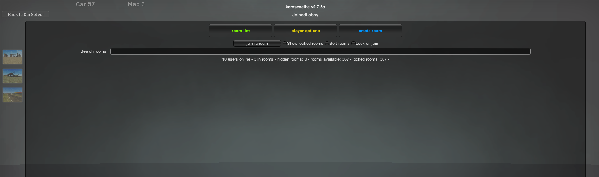
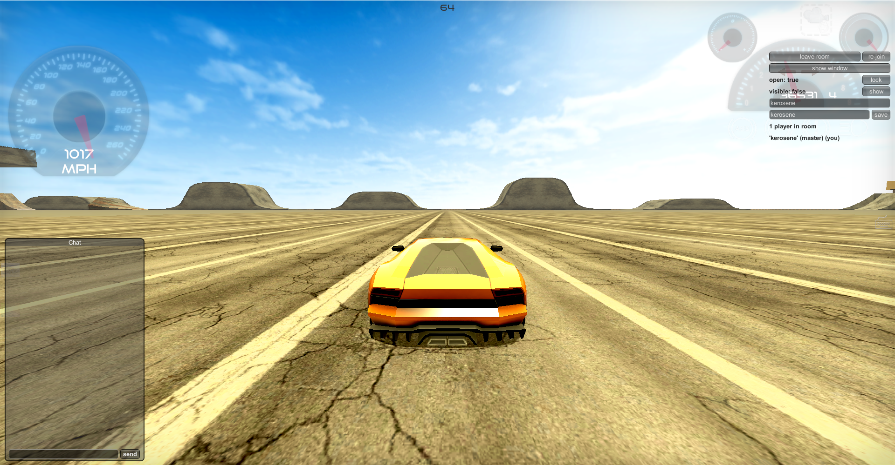
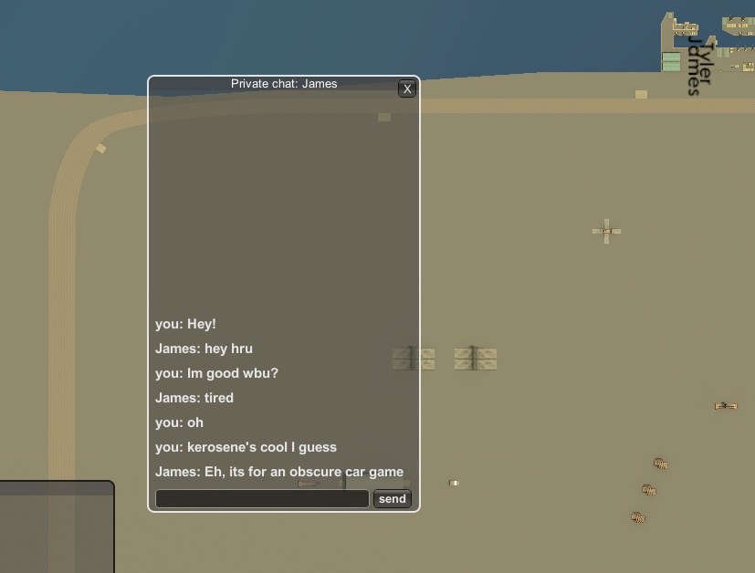

    

        <h1 class="header center red-text text-lighten-3">kerosene</h1>
        

            <h5 class="header col s12 light">a mod for a game</h5>
        

        

            <a href="https://github.com/ishuna/ishuna.github.io/releases/download/release/kerosene_release.zip" class="btn-large waves-effect waves-light purple lighten-2 rounded-btn">download</a>
        

    

    

        <h2 class="header center blue-text text-darken-2">about kerosene (lowercase k)</h2>
        
kerosene is a mod for Madalin Cars Multiplayer with now needed changes since the games dev doesnt seem to care that someone else is hacking it.

        
this is not affiliated with the game in any way, the game's already runied bc of someone else so I dont care if you go insane, its encouraged.

        
the features as is follows:

        <ul class="flow-text center">
            <li><b>anti-kick</b></li>
            <li><b>anti-name change</b></li>
            <li><b>anti-room close</b></li>
            <li><b>(meaning nobody can close or lock your rooms, nor kick you)</b></li>
        </ul>
        
gameplay features:

        <ul class="flow-text center">
            <li>speedhack</li>
            <li>flyhacks</li>
            <li>color changing</li>
            <li>infinite nitro</li>
            <li>noclip</li>
            <li>map changing (switch maps in-game without leaving)</li>
            <li>private messaging (chat with other players without anyone else seeing)</li>
        </ul>
    

        <h2 class="header center green-text text-darken-2">screenshots</h2>
        

            

                
            

            

                
            

            

                
            

            

                
            

        

    

